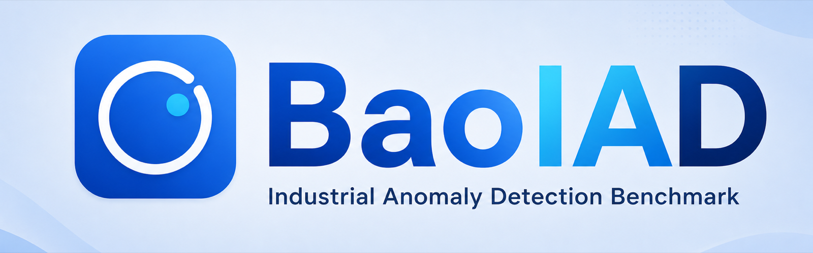
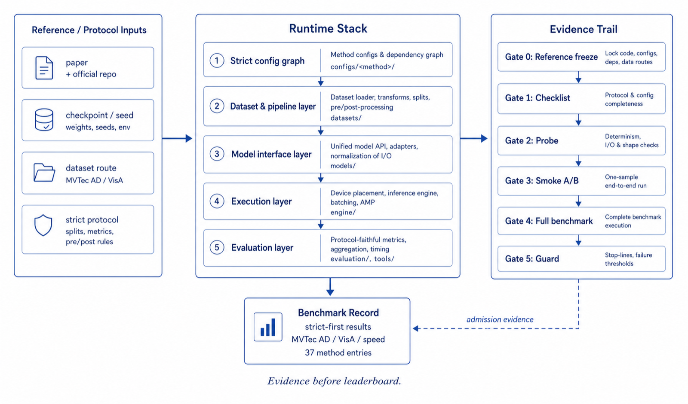
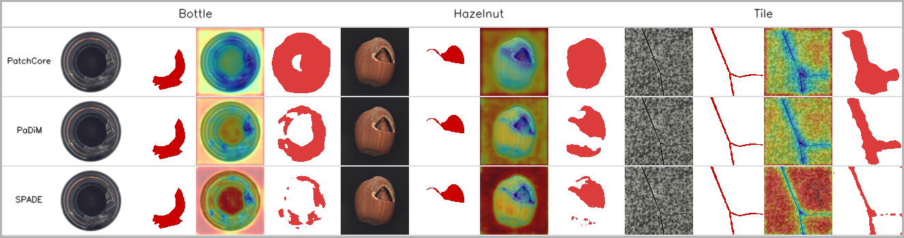

# BaoIAD

<p align="center">
  
</p>

<p align="center">
  English | <a href="README_zh-CN.md">简体中文</a>
</p>

<p align="center">
  <a href="https://baoiad.readthedocs.io/en/latest/"></a>
  <a href="LICENSE"></a>
</p>

BaoIAD is an MMEngine-based industrial anomaly detection benchmark with 37 repository-local method integrations across 9 families, maintained by [Baosight-xVue](https://github.com/Baosight-xVue).

Repository release checks have been executed on Python 3.10 and 3.12. Dataset adapters cover 10 public industrial anomaly-detection datasets; the datasets themselves are not distributed by this repository.

<p align="center">
  <a href="docs/en/get_started.md">🛠️ Installation</a> |
  <a href="#getting-started">🚀 Getting Started</a> |
  <a href="docs/en/model_zoo.md">📚 Model Zoo</a> |
  <a href="https://baoiad.readthedocs.io/en/latest/">📘 Documentation</a> |
  <a href="#contributing">🤝 Contributing</a> |
  <a href="#citation">📝 Citation</a>
</p>

## Scope and limitations

- BaoIAD is distributed as source code. It does not currently publish hosted checkpoints, a hosted demo, a Docker image, or a PyPI package.
- Users must obtain each dataset and any external pretrained artifact under its original terms, then configure the corresponding local path.
- Optional method families have different dependency and hardware requirements; installing the core package alone does not make every configuration runnable.
- Implementation provenance and validation depth vary across the 37-method inventory. Consult the [method-status manifest](docs/alignment/method_status.json), [documented exceptions](docs/alignment/exceptions.json), and [compliance checker](tools/check_release_compliance.py) before interpreting a method as independently reproduced.
- The visualization below is a qualitative illustration, not a uniform benchmark or ranking. It includes SPADE as an external, non-inventory reference alongside BaoIAD methods.

## Capabilities

BaoIAD provides config-driven training, testing, benchmarking, and repository-local implementation provenance and reproducibility notes for commonly used IAD methods.

- **Config-driven methods**: each method has a dedicated `configs/<method>/README.md` with its configuration entry points and method-specific notes.
- **Grouped model zoo**: methods are organized by modeling family so users can find related baselines quickly.
- **Method-level records**: [`docs/alignment/`](docs/alignment/) preserves reference freezes, implementation checks, behavior probes, known gaps, and historical validation records where available.
- **Unified benchmark tooling**: `tools/train.py`, `tools/test.py`, and `tools/benchmark.py` share the same config conventions.

## Architecture

<p align="center">
  
</p>

## Method Families

BaoIAD keeps 37 method integrations in 9 families. Method names link to config READMEs, and `evidence` links point to repository-local provenance and reproducibility records whose validation depth is defined by the method-status manifest. The same grouped overview is also available in the [Model Zoo](docs/en/model_zoo.md).

| **Self-supervised synthesis** | **Reconstruction / ViT** | **Discriminative** |
| --- | --- | --- |
| [GLASS](configs/glass/README.md) (ECCV'2024; [evidence](docs/alignment/glass.md))<br>[DRAEM](configs/draem/README.md) (ICCV'2021; [evidence](docs/alignment/draem.md))<br>[DSR](configs/dsr/README.md) (ECCV'2022; [evidence](docs/alignment/dsr.md))<br>[CutPaste](configs/cutpaste/README.md) (CVPR'2021; [evidence](docs/alignment/cutpaste.md))<br>[NSA](configs/nsa/README.md) (ECCV'2022; [evidence](docs/alignment/nsa.md)) | [Dinomaly](configs/dinomaly/README.md) (CVPR'2025; [evidence](docs/alignment/dinomaly.md))<br>[ViTAD](configs/vitad/README.md) (AAAI'2024; [evidence](docs/alignment/vitad.md))<br>[MemSeg](configs/memseg/README.md) (EAAI'2023; [evidence](docs/alignment/memseg.md))<br>[UniAD](configs/uniad/README.md) (NeurIPS'2022; [evidence](docs/alignment/uniad.md))<br>[GANomaly](configs/ganomaly/README.md) (ACCV'2018; [evidence](docs/alignment/ganomaly.md)) | [SimpleNet](configs/simplenet/README.md) (CVPR'2023; [evidence](docs/alignment/simplenet.md))<br>[SuperSimpleNet](configs/supersimplenet/README.md) (ICPR'2024; [evidence](docs/alignment/supersimplenet.md))<br>[CFA](configs/cfa/README.md) (IEEE Access'2022; [evidence](docs/alignment/cfa.md)) |

| **Knowledge distillation** | **Hybrid / unified** | **Normalizing flow** |
| --- | --- | --- |
| [RD++](configs/rdpp/README.md) (CVPR'2023; [evidence](docs/alignment/rdpp.md))<br>[AST](configs/ast/README.md) (WACV'2023; [evidence](docs/alignment/ast.md))<br>[RD](configs/rd/README.md) (CVPR'2022; [evidence](docs/alignment/rd.md))<br>[EfficientAD](configs/efficientad/README.md) (WACV'2024; [evidence](docs/alignment/efficientad.md))<br>[DeSTSeg](configs/destseg/README.md) (CVPR'2023; [evidence](docs/alignment/destseg.md)) | [UniNet](configs/uninet/README.md) (CVPR'2025; [evidence](docs/alignment/uninet.md)) | [U-Flow](configs/uflow/README.md) (JMIV'2024; [evidence](docs/alignment/uflow.md))<br>[CFlow](configs/cflow/README.md) (WACV'2022; [evidence](docs/alignment/cflow.md))<br>[DifferNet](configs/differnet/README.md) (WACV'2021; [evidence](docs/alignment/differnet.md))<br>[FastFlow](configs/fastflow/README.md) (arXiv'2021; [evidence](docs/alignment/fastflow.md))<br>[PyramidFlow](configs/pyramidflow/README.md) (CVPR'2023; [evidence](docs/alignment/pyramidflow.md)) |

| **Feature-memory / density** | **Vision-language / foundation** | **Few-shot / registration** |
| --- | --- | --- |
| [PatchCore](configs/patchcore/README.md) (CVPR'2022; [evidence](docs/alignment/patchcore.md))<br>[PaDiM](configs/padim/README.md) (ICPR'2021; [evidence](docs/alignment/padim.md))<br>[DFM](configs/dfm/README.md) (ICPR'2021; [evidence](docs/alignment/dfm.md))<br>[DFKDE](configs/dfkde/README.md) (Anomalib / ICIP'2022; [evidence](docs/alignment/dfkde.md)) | [MuSc](configs/musc/README.md) (ICLR'2024; [evidence](docs/alignment/musc.md))<br>[AACLIP](configs/aaclip/README.md) (CVPR'2025; [evidence](docs/alignment/aaclip.md))<br>[AnoVL](configs/anovl/README.md) (arXiv'2023; [evidence](docs/alignment/anovl.md))<br>[AnomalyCLIP](configs/anomalyclip/README.md) (ICLR'2024; [evidence](docs/alignment/anomalyclip.md))<br>[WinCLIP](configs/winclip/README.md) (CVPR'2023; [evidence](docs/alignment/winclip.md))<br>[AdaCLIP](configs/adaclip/README.md) (ECCV'2024; [evidence](docs/alignment/adaclip.md))<br>[SAA+](configs/saaplus/README.md) (arXiv'2023; [evidence](docs/alignment/saaplus.md)) | [AnomalyDINO](configs/anomalydino/README.md) (WACV'2025; [evidence](docs/alignment/anomalydino.md))<br>[RegAD](configs/regad/README.md) (ECCV'2022; [evidence](docs/alignment/regad.md)) |

## Dataset Configurations

The table counts BaoIAD **object entries** exposed by each dataset adapter. An
object entry is a benchmark object/category selectable through the adapter; a
**defect type** is an anomaly label within an object and is not counted here;
and a **base config** is the adapter-level configuration file, not one config
per object. See the [Dataset Zoo](docs/en/dataset_zoo.md) for the dataset-specific
taxonomy and preparation contract.

| Dataset | BaoIAD object entries | Base config |
|---------|----------------------:|-------------|
| MVTec AD | 15 | `configs/_base_/datasets/mvtec_ad.py` |
| VisA | 12 | `configs/_base_/datasets/visa.py` |
| BTech | 3 | `configs/_base_/datasets/btech.py` |
| MVTec 3D AD | 10 | `configs/_base_/datasets/mvtec_3d_ad.py` |
| MVTec LOCO | 5 | `configs/_base_/datasets/mvtec_loco_ad.py` |
| MPDD | 6 | `configs/_base_/datasets/mpdd.py` |
| MVTec AD 2 | 8 | `configs/_base_/datasets/mvtec_ad2.py` |
| Kolektor | 1 (adapter) | `configs/_base_/datasets/kolektor.py` |
| VAD | 1 (adapter) | `configs/_base_/datasets/vad.py` |
| RealIAD | 30 | `configs/_base_/datasets/realiad.py` |

## Evaluation Metrics

- **Image-level**: AUROC, F1-max, AP, ECE, FPR@95TPR
- **Pixel-level**: AUROC, F1-max, AP, AUPRO, AUPIMO, ECE

## Installation

Please refer to [Installation](docs/en/get_started.md) for detailed instructions.

```bash
# Create environment
conda create -n baoiad python=3.10 -y && conda activate baoiad

# Install BaoIAD
git clone https://github.com/Baosight-xVue/BaoIAD.git
cd BaoIAD
pip install -e .

# Optional dependency groups
pip install -e ".[flow]"    # Normalizing-flow methods
pip install -e ".[vl]"      # Vision-language methods
pip install -e ".[all]"     # Common optional method dependencies
```

Set up the data path:

```bash
source tools/env.sh
# Or: export BAOIAD_DATA_ROOT=/path/to/data
```

## Getting Started

```bash
# Train PatchCore on MVTec AD
python tools/train.py configs/patchcore/patchcore_wrn50_256_mvtec_strict.py --work-dir runs/patchcore

# Train a single category
python tools/train.py configs/patchcore/patchcore_wrn50_256_mvtec_strict.py \
    --work-dir runs/patchcore_bottle \
    --cfg-options train_dataloader.dataset.cls_names="['bottle']" train_dataloader.dataset.multi_class=False

# Test with a checkpoint
python tools/test.py configs/patchcore/patchcore_wrn50_256_mvtec_strict.py runs/patchcore/best.pth

# Benchmark multiple methods
python tools/benchmark.py --data_root data/mvtec_ad --methods patchcore rd --categories all \
    --output runs/benchmark_results.json
```

## Visualization

BaoIAD provides built-in visualization for anomaly detection results. Enable it during testing:

```bash
python tools/test.py <config> <checkpoint> \
    --cfg-options default_hooks.visualization.enable=True
```

<div align="center">


*Qualitative output-format examples on MVTec AD. For each category, columns show the input image, ground-truth mask, anomaly heatmap overlaid on the input, and predicted mask. Rows compare PatchCore, PaDiM, and SPADE; SPADE is an external comparison baseline and is not part of BaoIAD's 37-method inventory. These examples are not a benchmark ranking or a cross-configuration performance comparison.*
</div>

## Documentation Map

- [English docs](docs/en/index.rst)
- [Chinese docs](docs/zh_cn/index.rst)
- [Model zoo](docs/en/model_zoo.md)
- [Implementation provenance and reproducibility notes](docs/alignment/README.md)

## Validation

```bash
python tools/check_method_inventory.py
python tools/benchmark.py --methods all --help
```

`python tools/benchmark.py --methods all` resolves the 37-method repository inventory used by the benchmark helper.

## Contributing

Contributions, issue reports, and reproducibility fixes are welcome. Please open an issue or pull request with a clear description of the change and the validation you ran.

## Citation

If you use this toolbox or benchmark in your research, please cite this GitHub repository. The DOI below is the verified Zenodo concept DOI for all BaoIAD versions. The version-specific DOI for v1.1.0 will be added after the release archive is published.

```bibtex
@software{xu2026baoiad,
  title        = {BaoIAD: Towards Trustworthy and Reproducible Benchmarking for Industrial Anomaly Detection},
  author       = {Chenjie Xu and Yang Zhang and Tianyun Hu and Bing Hu},
  year         = {2026},
  version      = {1.1.0},
  doi          = {10.5281/zenodo.20067087},
  url          = {https://github.com/Baosight-xVue/BaoIAD}
}
```

## License

BaoIAD-authored source code is released under the [Apache 2.0 license](LICENSE). Third-party components, datasets, pretrained artifacts, and derived media remain subject to their own terms; see [Third-party notices](THIRD_PARTY_NOTICES.md) and the [resource inventory](resources/README.md).

## Acknowledgement

BaoIAD is maintained by the [Baosight-xVue](https://github.com/Baosight-xVue) organization and is built on top of [MMEngine](https://github.com/open-mmlab/mmengine) and [MMCV](https://github.com/open-mmlab/mmcv). We thank the OpenMMLab community for providing the foundational training infrastructure. We also thank the original authors of the integrated anomaly-detection methods for making their research and implementations publicly available.
