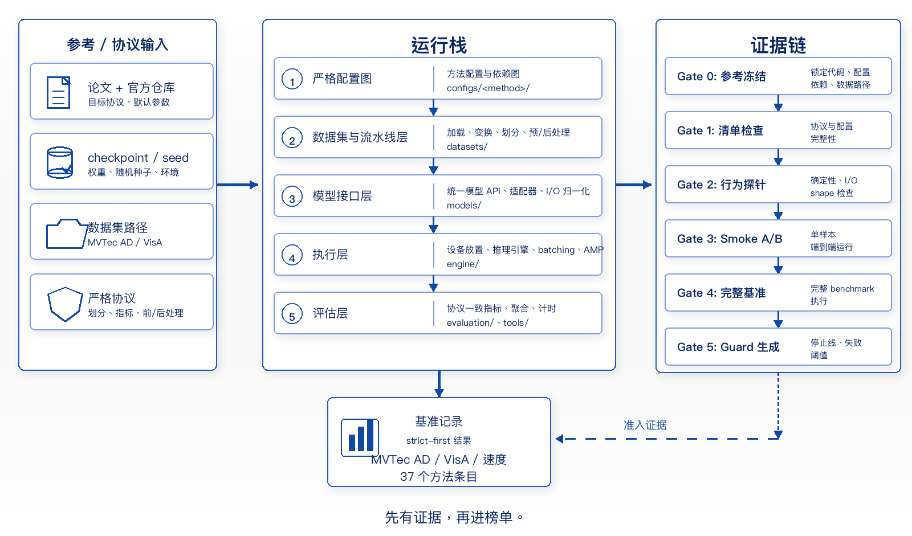

# BaoIAD

<p align="center">
  
</p>

<p align="center">
  <a href="README.md">English</a> | 简体中文
</p>

<p align="center">
  <a href="https://baoiad.readthedocs.io/en/latest/"></a>
  <a href="LICENSE"></a>
</p>

BaoIAD 是基于 MMEngine 的工业异常检测基准，在 9 个方法家族中提供 37 个仓库内方法集成。

<p align="center">
  <a href="docs/zh_cn/get_started.md">🛠️ 安装</a> |
  <a href="#快速开始">🚀 快速开始</a> |
  <a href="docs/zh_cn/model_zoo.md">📚 模型库</a> |
  <a href="https://baoiad.readthedocs.io/en/latest/">📘 文档</a> |
  <a href="#贡献">🤝 贡献</a> |
  <a href="#引用">📝 引用</a>
</p>

## 主要能力

BaoIAD 提供配置化训练、测试、批量基准流程，并为常用 IAD 方法保存仓库内实现溯源与可复现性记录。

- **配置化方法入口**：每个方法目录都有 `configs/<method>/README.md`，列出配置入口和方法特有说明。
- **按家族组织的模型库**：方法按建模思路分组，方便快速定位相关基线。
- **方法级记录**：[`docs/alignment/`](docs/alignment/) 按可用情况保存 reference freeze、实现检查、行为 probe、已知缺口和历史验证记录。
- **统一基准工具**：`tools/train.py`、`tools/test.py` 和 `tools/benchmark.py` 使用一致的配置约定。

## 架构图

<p align="center">
  
</p>

## 方法家族

BaoIAD 当前保留 37 个方法集成，按 9 个家族组织。方法名链接到 config README，`evidence` 链接到仓库内实现溯源与可复现性记录，其验证深度以方法状态清单为准。同样的分组总览也保留在 [模型库](docs/zh_cn/model_zoo.md)。

| **自监督合成** | **重建 / ViT** | **判别式方法** |
| --- | --- | --- |
| [GLASS](configs/glass/README.md) (ECCV'2024; [evidence](docs/alignment/glass.md))<br>[DRAEM](configs/draem/README.md) (ICCV'2021; [evidence](docs/alignment/draem.md))<br>[DSR](configs/dsr/README.md) (ECCV'2022; [evidence](docs/alignment/dsr.md))<br>[CutPaste](configs/cutpaste/README.md) (CVPR'2021; [evidence](docs/alignment/cutpaste.md))<br>[NSA](configs/nsa/README.md) (ECCV'2022; [evidence](docs/alignment/nsa.md)) | [Dinomaly](configs/dinomaly/README.md) (CVPR'2025; [evidence](docs/alignment/dinomaly.md))<br>[ViTAD](configs/vitad/README.md) (AAAI'2024; [evidence](docs/alignment/vitad.md))<br>[MemSeg](configs/memseg/README.md) (EAAI'2023; [evidence](docs/alignment/memseg.md))<br>[UniAD](configs/uniad/README.md) (NeurIPS'2022; [evidence](docs/alignment/uniad.md))<br>[GANomaly](configs/ganomaly/README.md) (ACCV'2018; [evidence](docs/alignment/ganomaly.md)) | [SimpleNet](configs/simplenet/README.md) (CVPR'2023; [evidence](docs/alignment/simplenet.md))<br>[SuperSimpleNet](configs/supersimplenet/README.md) (ICPR'2024; [evidence](docs/alignment/supersimplenet.md))<br>[CFA](configs/cfa/README.md) (IEEE Access'2022; [evidence](docs/alignment/cfa.md)) |

| **知识蒸馏** | **混合 / 统一框架** | **归一化流** |
| --- | --- | --- |
| [RD++](configs/rdpp/README.md) (CVPR'2023; [evidence](docs/alignment/rdpp.md))<br>[AST](configs/ast/README.md) (WACV'2023; [evidence](docs/alignment/ast.md))<br>[RD](configs/rd/README.md) (CVPR'2022; [evidence](docs/alignment/rd.md))<br>[EfficientAD](configs/efficientad/README.md) (WACV'2024; [evidence](docs/alignment/efficientad.md))<br>[DeSTSeg](configs/destseg/README.md) (CVPR'2023; [evidence](docs/alignment/destseg.md)) | [UniNet](configs/uninet/README.md) (CVPR'2025; [evidence](docs/alignment/uninet.md)) | [U-Flow](configs/uflow/README.md) (JMIV'2024; [evidence](docs/alignment/uflow.md))<br>[CFlow](configs/cflow/README.md) (WACV'2022; [evidence](docs/alignment/cflow.md))<br>[DifferNet](configs/differnet/README.md) (WACV'2021; [evidence](docs/alignment/differnet.md))<br>[FastFlow](configs/fastflow/README.md) (arXiv'2021; [evidence](docs/alignment/fastflow.md))<br>[PyramidFlow](configs/pyramidflow/README.md) (CVPR'2023; [evidence](docs/alignment/pyramidflow.md)) |

| **特征记忆 / 密度估计** | **视觉语言 / 基础模型** | **少样本 / 配准** |
| --- | --- | --- |
| [PatchCore](configs/patchcore/README.md) (CVPR'2022; [evidence](docs/alignment/patchcore.md))<br>[PaDiM](configs/padim/README.md) (ICPR'2021; [evidence](docs/alignment/padim.md))<br>[DFM](configs/dfm/README.md) (ICPR'2021; [evidence](docs/alignment/dfm.md))<br>[DFKDE](configs/dfkde/README.md) (Anomalib / ICIP'2022; [evidence](docs/alignment/dfkde.md)) | [MuSc](configs/musc/README.md) (ICLR'2024; [evidence](docs/alignment/musc.md))<br>[AACLIP](configs/aaclip/README.md) (CVPR'2025; [evidence](docs/alignment/aaclip.md))<br>[AnoVL](configs/anovl/README.md) (arXiv'2023; [evidence](docs/alignment/anovl.md))<br>[AnomalyCLIP](configs/anomalyclip/README.md) (ICLR'2024; [evidence](docs/alignment/anomalyclip.md))<br>[WinCLIP](configs/winclip/README.md) (CVPR'2023; [evidence](docs/alignment/winclip.md))<br>[AdaCLIP](configs/adaclip/README.md) (ECCV'2024; [evidence](docs/alignment/adaclip.md))<br>[SAA+](configs/saaplus/README.md) (arXiv'2023; [evidence](docs/alignment/saaplus.md)) | [AnomalyDINO](configs/anomalydino/README.md) (WACV'2025; [evidence](docs/alignment/anomalydino.md))<br>[RegAD](configs/regad/README.md) (ECCV'2022; [evidence](docs/alignment/regad.md)) |

## 数据集配置

下表统计每个数据集适配器对外提供的 BaoIAD **对象入口**。“对象入口”是可通过适配器选择的基准对象/类别；“**缺陷类型**”是对象内部的异常标签，不在此计数；“**基础配置**”是适配器级配置文件，不代表每个对象各有一份配置。数据集的具体分类与准备约定见[数据集模型库](docs/zh_cn/dataset_zoo.md)。

| 数据集 | BaoIAD 对象入口 | 基础配置 |
|---------|------------------:|----------|
| MVTec AD | 15 | `configs/_base_/datasets/mvtec_ad.py` |
| VisA | 12 | `configs/_base_/datasets/visa.py` |
| BTech | 3 | `configs/_base_/datasets/btech.py` |
| MVTec 3D AD | 10 | `configs/_base_/datasets/mvtec_3d_ad.py` |
| MVTec LOCO | 5 | `configs/_base_/datasets/mvtec_loco_ad.py` |
| MPDD | 6 | `configs/_base_/datasets/mpdd.py` |
| MVTec AD 2 | 8 | `configs/_base_/datasets/mvtec_ad2.py` |
| Kolektor | 1（适配器） | `configs/_base_/datasets/kolektor.py` |
| VAD | 1（适配器） | `configs/_base_/datasets/vad.py` |
| RealIAD | 30 | `configs/_base_/datasets/realiad.py` |

## 评价指标

- **图像级**：AUROC、F1-max、AP、ECE、FPR@95TPR
- **像素级**：AUROC、F1-max、AP、AUPRO、AUPIMO、ECE

## 安装

详细步骤见 [安装文档](docs/zh_cn/get_started.md)。

```bash
# 创建环境
conda create -n baoiad python=3.10 -y && conda activate baoiad

# 安装 BaoIAD
git clone https://github.com/Baosight-xVue/BaoIAD.git
cd BaoIAD
pip install -e .

# 可选依赖组
pip install -e ".[flow]"    # 归一化流方法
pip install -e ".[vl]"      # 视觉语言方法
pip install -e ".[all]"     # 常用可选依赖
```

设置数据路径：

```bash
source tools/env.sh
# 或手动设置：export BAOIAD_DATA_ROOT=/path/to/data
```

## 快速开始

```bash
# 在 MVTec AD 上训练 PatchCore
python tools/train.py configs/patchcore/patchcore_wrn50_256_mvtec_strict.py --work-dir runs/patchcore

# 训练单个类别
python tools/train.py configs/patchcore/patchcore_wrn50_256_mvtec_strict.py \
    --work-dir runs/patchcore_bottle \
    --cfg-options train_dataloader.dataset.cls_names="['bottle']" train_dataloader.dataset.multi_class=False

# 使用 checkpoint 测试
python tools/test.py configs/patchcore/patchcore_wrn50_256_mvtec_strict.py runs/patchcore/best.pth

# 基准评测多个方法
python tools/benchmark.py --data_root data/mvtec_ad --methods patchcore rd --categories all \
    --output runs/benchmark_results.json
```

## 可视化

BaoIAD 内置异常检测结果可视化功能，测试时启用即可：

```bash
python tools/test.py <config> <checkpoint> \
    --cfg-options default_hooks.visualization.enable=True
```

## 文档导航

- [英文文档](docs/en/index.rst)
- [中文文档](docs/zh_cn/index.rst)
- [模型库](docs/zh_cn/model_zoo.md)
- [实现溯源与可复现性记录](docs/alignment/README.md)

## 校验

```bash
python tools/check_method_inventory.py
python tools/benchmark.py --methods all --help
```

`python tools/benchmark.py --methods all` 会解析基准工具使用的 37 方法仓库清单。

## 贡献

欢迎提交 issue、pull request 和可复现性修复。请在提交时说明改动内容以及已经运行的验证。

## 引用

如果您在研究中使用了本工具箱或基准评测，请引用本 GitHub 仓库。下方 DOI 是已验证的 Zenodo 概念 DOI，用于代表 BaoIAD 的所有版本。v1.1.0 的版本专属 DOI 将在发布归档公开后补充。

```bibtex
@software{xu2026baoiad,
  title        = {BaoIAD: Towards Trustworthy and Reproducible Benchmarking for Industrial Anomaly Detection},
  author       = {Chenjie Xu and Yang Zhang and Tianyun Hu and Bing Hu},
  year         = {2026},
  version      = {1.1.0},
  doi          = {10.5281/zenodo.20067087},
  url          = {https://github.com/Baosight-xVue/BaoIAD}
}
```

## 许可证

BaoIAD 自有源代码基于 [Apache 2.0 许可证](LICENSE) 发布。
