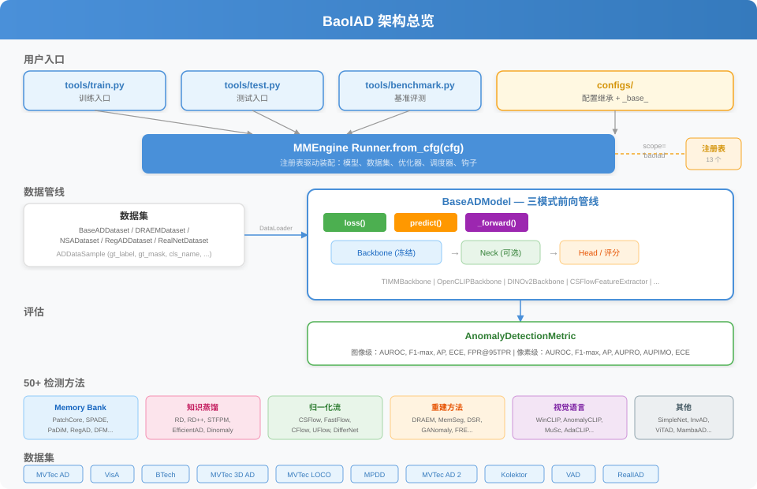

<div align="center">
  

  [](https://baoiad.readthedocs.io/en/latest/)
  [](LICENSE)
  [](https://www.python.org/)
  [](https://pytorch.org/)
  [](docs/en/model_zoo.md)
  [](https://github.com/ChenjieXu/BaoIAD)

  [English](README.md) | 简体中文

  [📘 文档](https://baoiad.readthedocs.io/en/latest/) |
  [🛠️ 安装](docs/en/get_started.md) |
  [🚀 训练与测试](docs/en/user_guides/train_test.md) |
  [📊 基准评测](docs/en/user_guides/benchmark.md) |
  [🔧 自定义模型](docs/en/advanced_guides/customize_models.md)
</div>

<br>

<div align="center">
  
</div>

## 简介

BaoIAD 是一个面向**工业异常检测 (IAD)** 的统一基准评测框架，基于 [MMEngine](https://github.com/open-mmlab/mmengine)（OpenMMLab 风格）构建。它在统一的配置驱动接口下集成了 **50+ 种异常检测方法**，支持 10+ 个数据集上的公平对比。

主要特性：

- **模块化设计**：遵循 OpenMMLab 规范，将 AD 框架分解为 backbone、neck、head 等组件，可通过配置文件灵活组合。
- **50+ 方法开箱即用**：覆盖 Memory Bank、知识蒸馏、归一化流、重建、视觉语言、判别器等主流范式，并与参考实现对齐。
- **公平对比**：标准化的 backbone 配置、一致的评估指标（图像级 + 像素级）和统一的数据管线，确保跨方法基准评测的公平性。
- **配置驱动**：所有实验通过 Python 配置文件控制，支持继承——无需修改代码即可切换方法、数据集或超参数。

## 模型库总览

| | | | |
| --- | --- | --- | --- |
| **Memory Bank** | **知识蒸馏** | **归一化流** | **重建方法** |
| [PatchCore](configs/patchcore/) (CVPR'2022)<br>[SPADE](configs/spade/) (ICPR'2021)<br>[PaDiM](configs/padim/) (ICPR'2021)<br>[DFM](configs/dfm/) (IWCF'2022)<br>[DFKDE](configs/dfkde/) (IWCF'2022)<br>[RegAD](configs/regad/) (ECCV'2022)<br>[GraphCore](configs/graphcore/) (ECCV'2024) | [RD](configs/rd/) (CVPR'2022)<br>[RD++](configs/rdpp/) (ICCV'2023)<br>[STFPM](configs/stfpm/) (WACV'2021)<br>[EfficientAD](configs/efficientad/) (CVPR'2024)<br>[Dinomaly](configs/dinomaly/) (arXiv'2024)<br>[AST](configs/ast/) (ECCV'2022) | [CSFlow](configs/csflow/) (WACV'2022)<br>[FastFlow](configs/fastflow/) (CVPR'2022)<br>[CFlow](configs/cflow/) (WACV'2022)<br>[UFlow](configs/uflow/) (PR'2023)<br>[DifferNet](configs/differnet/) (WACV'2021)<br>[PyramidFlow](configs/pyramidflow/) (CVPR'2023) | [DRAEM](configs/draem/) (ICCV'2021)<br>[MemSeg](configs/memseg/) (NeurIPS'2022)<br>[DeSTSeg](configs/destseg/) (CVPR'2023)<br>[MemAE](configs/memae/) (ICCV'2019)<br>[FRE](configs/fre/) (ICPR'2021)<br>[GANomaly](configs/ganomaly/) (ACCV'2018)<br>[DSR](configs/dsr/) (ECCV'2022) |

| | | | |
| --- | --- | --- | --- |
| **视觉语言** | **判别器** | **统一多类** | **自监督** |
| [WinCLIP](configs/winclip/) (CVPR'2023)<br>[AnomalyCLIP](configs/anomalyclip/) (ICLR'2024)<br>[AnoVL](configs/anovl/) (AAAI'2024)<br>[MuSc](configs/musc/) (CVPR'2024)<br>[AdaCLIP](configs/adaclip/) (arXiv'2024)<br>[AACLIP](configs/aaclip/) (arXiv'2024)<br>[AnomalyDINO](configs/anomalydino/) (arXiv'2024) | [SimpleNet](configs/simplenet/) (CVPR'2023)<br>[SuperSimpleNet](configs/supersimplenet/) (arXiv'2024)<br>[CFA](configs/cfa/) (Access'2022) | [InvAD](configs/invad/) (AAAI'2024)<br>[ViTAD](configs/vitad/) (ECCV'2024)<br>[UniAD](configs/uniad/) (NeurIPS'2022)<br>[MambaAD](configs/mambaad/) (arXiv'2024)<br>[UniNet](configs/uninet/) (arXiv'2024)<br>[UniVAD](configs/univad/) (arXiv'2024) | [NSA](configs/nsa/) (CVPR'2022)<br>[CutPaste](configs/cutpaste/) (CVPR'2021)<br>[GLASS](configs/glass/) (arXiv'2024)<br>[PNI](configs/pni/) (ICLR'2024)<br>[RealNet](configs/realnet/) (CVPR'2024)<br>[ResAD](configs/resad/) (arXiv'2024)<br>[ComposeAD](configs/compose_ad/) |

### 支持的数据集

| 数据集 | 类别数 | 配置 |
|--------|--------|------|
| MVTec AD | 15 | `configs/_base_/datasets/mvtec_ad.py` |
| VisA | 12 | `configs/_base_/datasets/visa.py` |
| BTech | 3 | `configs/_base_/datasets/btech.py` |
| MVTec 3D AD | 10 | `configs/_base_/datasets/mvtec_3d_ad.py` |
| MVTec LOCO | 5 | `configs/_base_/datasets/mvtec_loco_ad.py` |
| MPDD | 6 | `configs/_base_/datasets/mpdd.py` |
| MVTec AD 2 | 16 | `configs/_base_/datasets/mvtec_ad2.py` |
| Kolektor | 3 | `configs/_base_/datasets/kolektor.py` |
| VAD | 6 | `configs/_base_/datasets/vad.py` |
| RealIAD | — | `configs/_base_/datasets/realiad.py` |

### 评估指标

- **图像级**：AUROC, F1-max, AP, ECE, FPR@95TPR
- **像素级**：AUROC, F1-max, AP, AUPRO, AUPIMO, ECE

## 安装

详细安装说明请参考 [Installation](docs/en/get_started.md)。

```bash
# 创建环境
conda create -n baoiad python=3.10 -y && conda activate baoiad

# 安装 BaoIAD
git clone https://github.com/ChenjieXu/BaoIAD.git
cd BaoIAD
pip install -e .

# 可选依赖
pip install -e ".[flow]"    # 归一化流方法 (CSFlow, FastFlow 等)
pip install -e ".[vl]"      # 视觉语言方法 (WinCLIP, AnomalyCLIP 等)
pip install -e ".[all]"     # 安装所有
```

设置数据路径：

```bash
source tools/env.sh
# 或手动设置：export BAOIAD_DATA_ROOT=/path/to/data
```

## 快速开始

```bash
# 在 MVTec AD 上训练 PatchCore
python tools/train.py configs/patchcore/patchcore_wrn50_256_mvtec_strict.py --work-dir runs/patchcore

# 训练单个类别
python tools/train.py configs/patchcore/patchcore_wrn50_256_mvtec_strict.py \
    --work-dir runs/patchcore_bottle \
    --cfg-options train_dataloader.dataset.cls_names="['bottle']" train_dataloader.dataset.multi_class=False

# 使用 checkpoint 测试
python tools/test.py configs/patchcore/patchcore_wrn50_256_mvtec_strict.py runs/patchcore/best.pth

# 基准评测多个方法
python tools/benchmark.py --data_root data/mvtec_ad --methods patchcore rd --categories all \
    --output runs/benchmark_results.json
```

## 贡献

我们欢迎所有对 BaoIAD 的贡献。请参考 [CONTRIBUTING.md](CONTRIBUTING.md) 了解贡献指南。

## 引用

如果您在研究中使用了本工具箱或基准评测，请引用本项目。

```bibtex
@article{baoiad2025,
  title={BaoIAD: A Unified Benchmark for Industrial Anomaly Detection},
  author={Chenjie Xu},
  journal={arXiv preprint},
  year={2025}
}
```

## 许可证

本项目基于 [Apache 2.0 许可证](LICENSE) 发布。

## 致谢

BaoIAD 基于 [MMEngine](https://github.com/open-mmlab/mmengine) 和 [MMCV](https://github.com/open-mmlab/mmcv) 构建。感谢 OpenMMLab 社区提供的基础训练设施，也感谢所有已实现方法的原始作者开源其代码。
